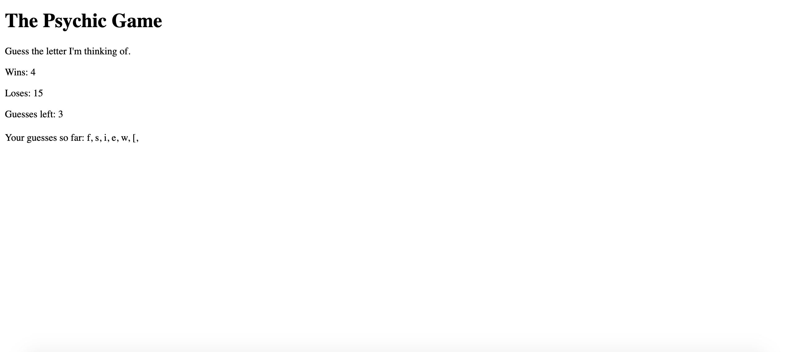

# Psychic-Game

Used javascript to have the computer generate a random letter upon pressing any key. The computer then checks to see if each guess by the player matches the letter guessed by the computer. If so, the win count goes up by one and the game resets. Each guess by the player will also cause the guesses remaining count to decrease. When that number hits zero, the loss count goes up by one and the game resets again. 

# Technologies-Used
html, javascript

# Authors
Alton Shu